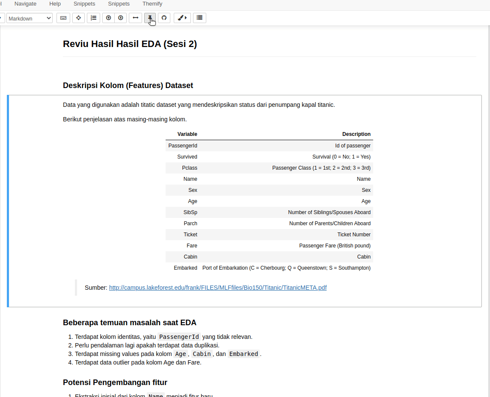

# Themify Extension
---

This extension let you make over view of your boring jupyter notebook.

## Install Extension

Install this extension using this command:

```bash
git clone git://github.com/maziyank/nb-themify
jupyter nbextension install nb-themify 
```

## Enable Extension
```bash
jupyter nbextension enable nb-themify/main
```

## Usage
- Select Themefy on Main Menu




## Working on Progress:
- Persist theme state on notebook.
